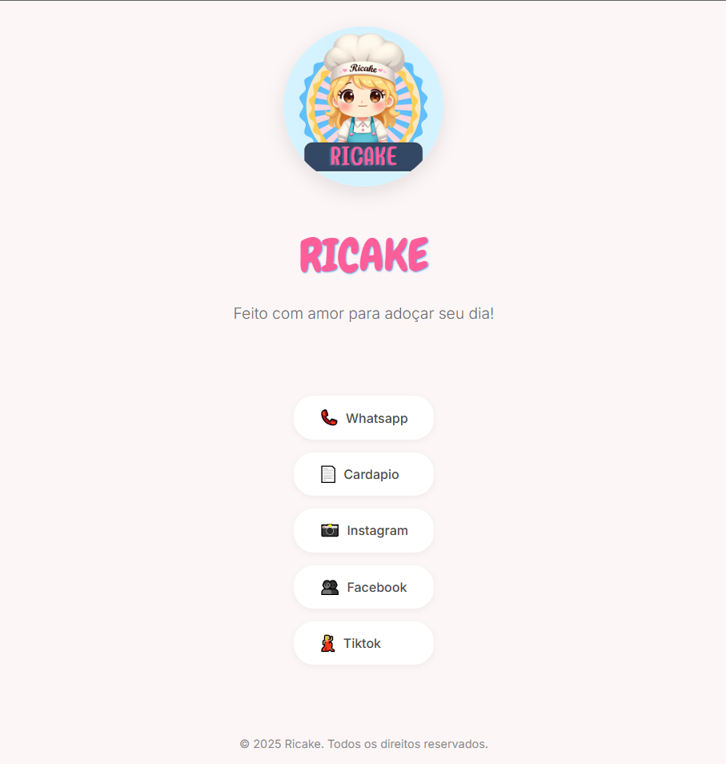

🍰 Confeitaria - Linktree Personalizado

Este projeto é uma landing page moderna e elegante para uma confeitaria, criada com Vue 3 e CSS scoped. Ele funciona como um Linktree personalizado, reunindo links para redes sociais e informações essenciais da confeitaria em um único lugar.

✨ Tecnologias Utilizadas

Vue 3 

Vite

CSS Scoped

Responsividade com Flexbox e Grid

📸 Preview

🚀 Como Rodar o Projeto

1️⃣ Clonar o Repositório

git clone https://github.com/seu-usuario/nome-do-repositorio.git

2️⃣ Acessar a Pasta do Projeto

cd nome-do-repositorio

3️⃣ Instalar as Dependências

npm install

4️⃣ Rodar o Servidor de Desenvolvimento

npm run dev

O projeto estará disponível em http://localhost:5173/ (ou a porta exibida no terminal).

🎨 Personalização

Caso queira alterar as cores ou informações do projeto:

Edite o arquivo src/components/Links.vue para modificar os links e textos.

Edite src/assets/styles.css para personalizar o design.

📜 Licença

Este projeto está sob a licença MIT. Sinta-se livre para utilizá-lo e modificá-lo!

💡 Dúvidas ou sugestões? Sinta-se à vontade para abrir uma issue ou contribuir com o projeto! 😊
